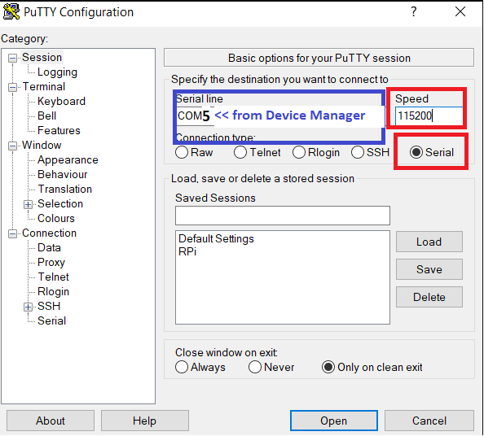

# Overview 
This project will forward stdout and stdin from the System Workbench IDE console to the MCU's UART. Access to the MCU's UART interface will be through a terminal emulator program called PuTTY. 

# Procedure
1. Go to the Device Manager to find the COM port where the UART will be accessed from. The COM port number you need is in blue. In this picture it is COM5.  

2. Load the code onto the processor (click Run).  
 
3. Open a PuTTY window to see the output of the UART.  
 
4. See Output!  
  

# References
[STM32 System Workbench UART Printf project](https://github.com/STMicroelectronics/STM32CubeF4/tree/master/Projects/STM32F411RE-Nucleo/Examples/UART/UART_Printf/SW4STM32) : Even though this project's build configuration didn't work, I used their code to forward the printf to the virtual COM Port supplied by the nucleo.

