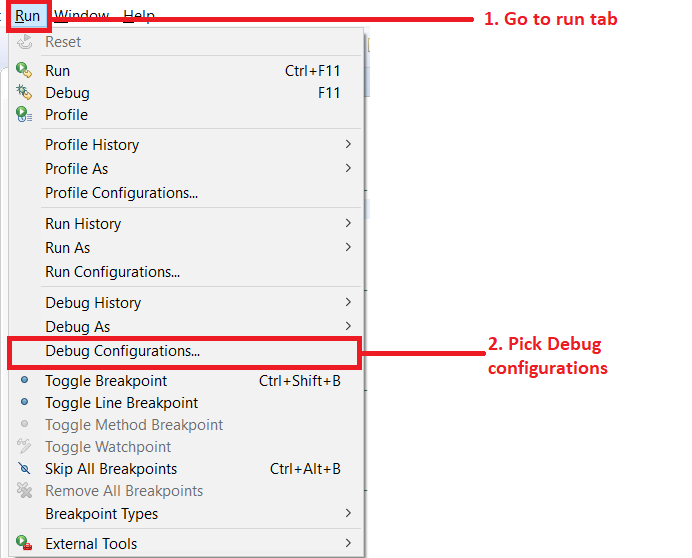
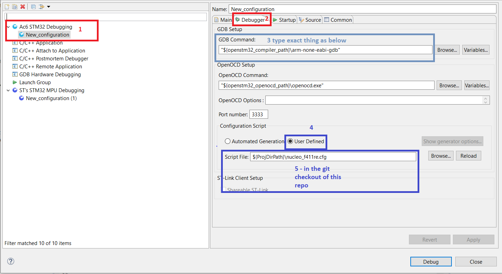

# Overview 
This repository is meant as an introduction to writing drivers for basic microcontroller peripherals and best practices for developing microcontroller drivers. The repository will grow as nothingmuchyou learns more about the STM32F411RE processor. This repo-tutorial series assumes little to no experience. 

# Getting Started
This project is low budget, and the tools are chosen as such. We are using a cheap EVK, free open-source IDE and other free software programs. More hardware will be added as we flesh out which projects are the most helpful. 

### Software 

* [System Workbench](https://www.openstm32.org/HomePage) : Note that you have to make an account in order to download System Workbench. System Workbench uses the Eclipse build environment. 
* [PuTTY](https://www.chiark.greenend.org.uk/~sgtatham/putty/latest.html) : Terminal emulator program 
* [Git](https://git-scm.com/downloads): In order to clone this repo, branch, commit, merge, etc you need a local copy of git. 

### Hardware
[STM32F411RE Nucleo](https://www.st.com/en/evaluation-tools/nucleo-f411re.html) board: This breaks out most of the GPIO on the STM32F411RE processor in order to analyze the logic as well input signals to the processor. These GPIO are mostly broken out on the connectors, but are also added to certain parts of the Nucleo board, such as the blue button! 

# Gotchas
This section is for troubleshooting  unexpected hiccups with your project(s).

### System Workbench Debug Configuration
If you get an error message when trying to Debug or load code onto the Nucleo board make sure that your debug configuration is setup correctly.
1. Access the Debug Configurations under the "Run --> Debug Configurations..."

2. Make sure your debug configuration matches the setup below. **NOTE**: By default STM32Cube did not generate a *.cfg* file for my project. This file tells *OpenOCD* how to debug your project for the specific board you are using. I had to import one that someone graciously uploaded to some far-off forum. '

# Acronyms

**IDE** : **I**ntegrated **D**evelopment **E**nvironment

**UART** : **U**niversal **A**synchronous **R**eceiver **T**ransmitter 

**EVK** : **EV**aluation **K**it

**GPIO** : **G**eneral **P**urpose **I**nput **O**utput 

