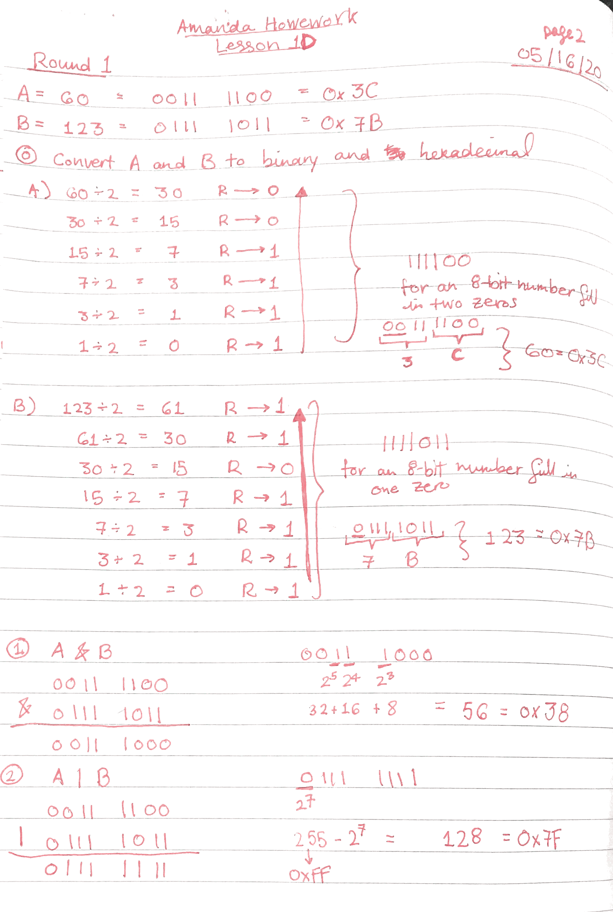
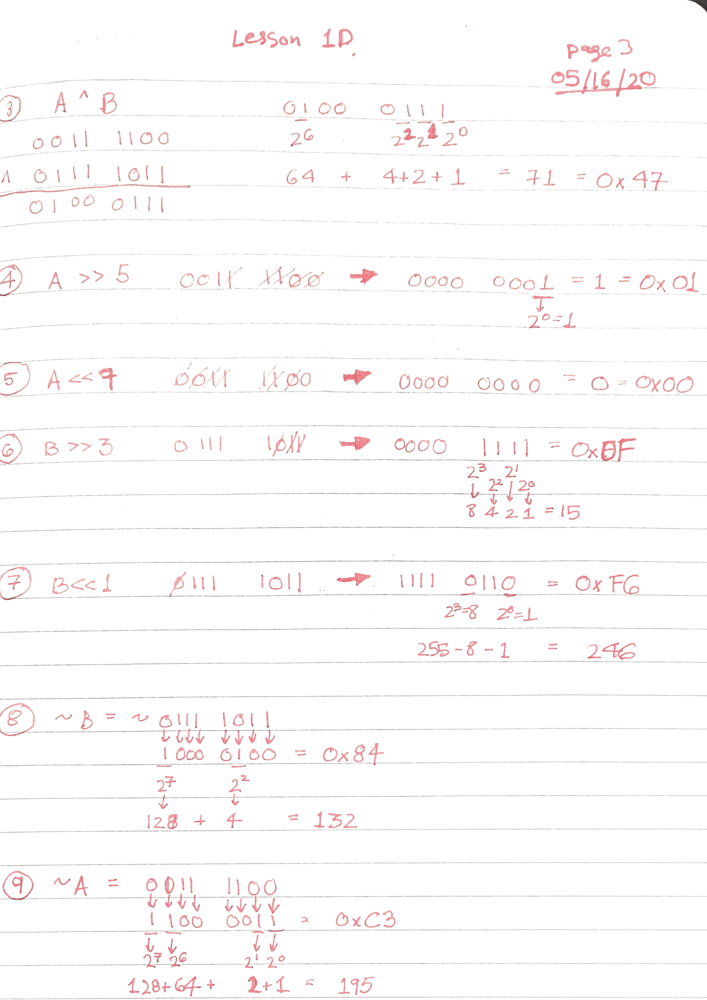
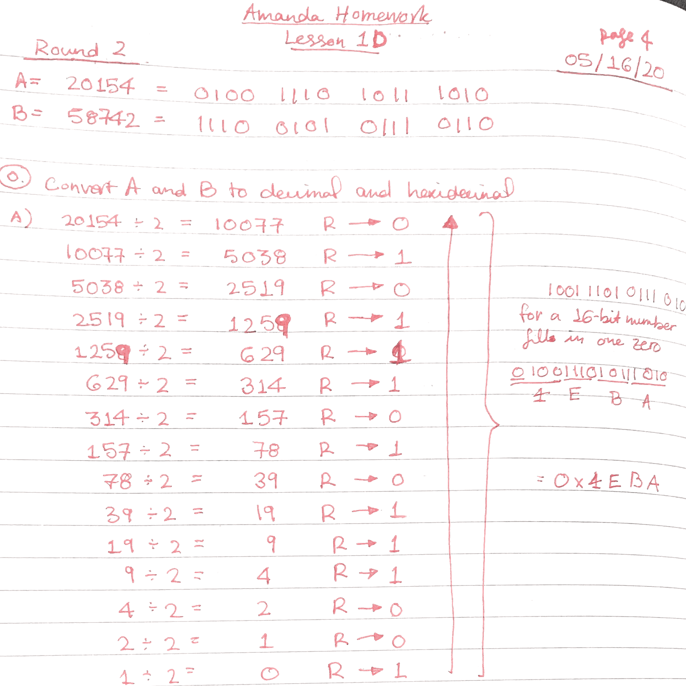
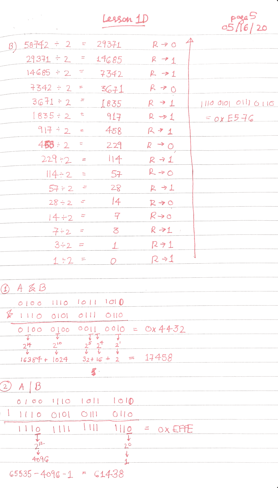
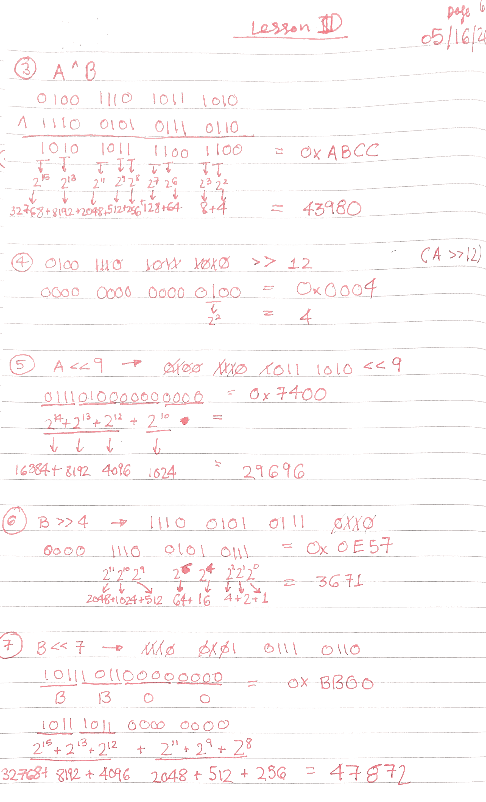
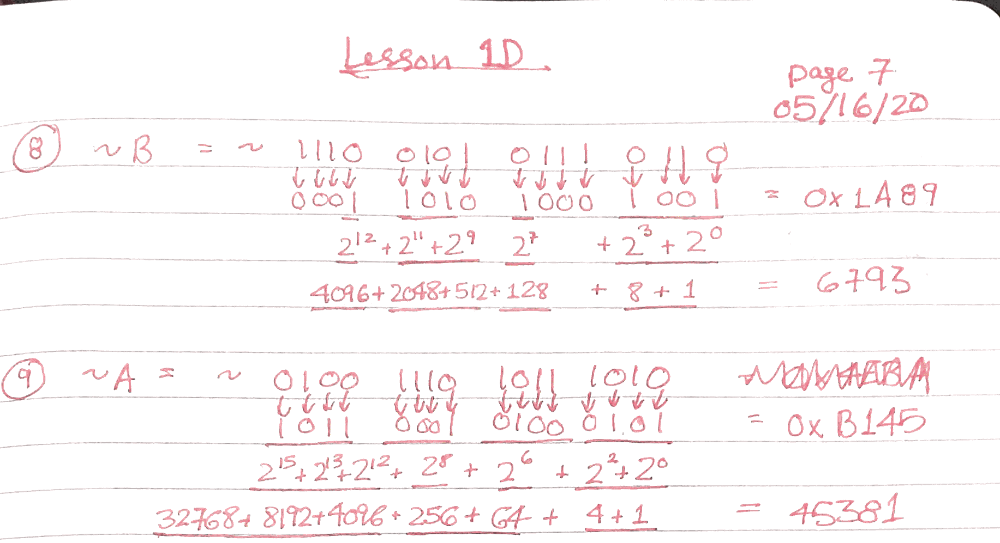

# Check your answers against mine

### Handwritten mistakes SORRY
- The page numbers are off by 1 sorry that's my bad  
- Round one number two should be **127** NOT 128
- Round 1 I got 8 and 9 mixed up 
- Round 2 I got 8 and 9 mixed up 

  
  
### Other things to note
- Round 1 number 7 will print `1e00` because of the format specifier in `printf` but the answer `00` is still correct because we are assuming the variable can only hold 8-bits (two hex nibbles).
- same thing with Round 2 number 5: it will print `xx7400` because of the format specifier in `printf` but the answer `7400` is still correct because we are assuming the variable can only hold 16-bits (4 hex nibble).








# Script to check your answers with code 
```c
#include <stdio.h>
#include <stdint.h>

static void perform_round(uint8_t round_num, uint16_t A, uint16_t B,
                          uint8_t sr_4, uint8_t sl_5, uint8_t sr_6, uint8_t sl_7,
                          uint8_t num_bits); 

int main()
{
    printf("Lesson ID Answers\r\n");
    printf("--------------------------\r\n");
    perform_round(1, 60, 123, 5, 7, 3, 1, 8);     
    perform_round(2, 20154, 58742, 12, 9, 4, 7, 16);  

    return 0;
}

static void perform_round(uint8_t round_num, uint16_t A, uint16_t B,
                          uint8_t sr_4, uint8_t sl_5, uint8_t sr_6, uint8_t sl_7,
                          uint8_t num_bits)
{
    printf(">>> Round Number %d <<<\r\n", round_num); 
    printf("1. A & B = %d (0x%x)\r\n", A & B, A & B); 
    printf("2. A | B = %d (0x%x)\r\n", A | B, A | B); 
    printf("3. A ^ B = %d (0x%x)\r\n", A ^ B, A ^ B); 
    printf("4. A >> %d = %d (0x%x)\r\n", sr_4, A >> sr_4, A >> sr_4); 
    printf("5. A << %d = %d (0x%x)\r\n", sl_5, (A << sl_5) & 0xFFFF, A << sl_5); 
    printf("6. B >> %d = %d (0x%x)\r\n", sr_6, B >> sr_6, B >> sr_6); 
    printf("7. B << %d = %d (0x%x)\r\n", sl_7, B << sl_7, B << sl_7);
    
    if(num_bits == 8)
    {
     printf("7. ~A = %u (0x%x)\r\n", (uint8_t)~A, (uint8_t)~A);
     printf("8. ~B = %u (0x%x)\r\n", (uint8_t) ~B, (uint8_t)~B);
    }
    else if(num_bits == 16)
    {
     printf("7. ~A = %u (0x%x)\r\n", (uint16_t)~A, (uint16_t)~A);
     printf("8. ~B = %u (0x%x)\r\n", (uint16_t) ~B, (uint16_t)~B);
    }
   
    printf("\r\n\r\n");
    
}
```
