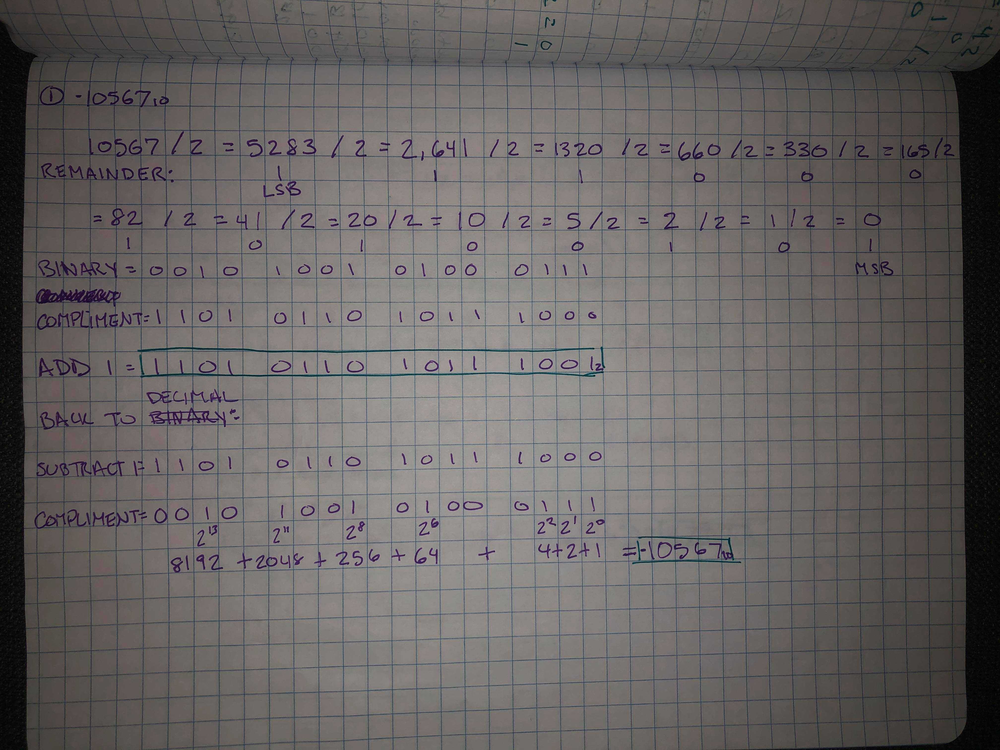
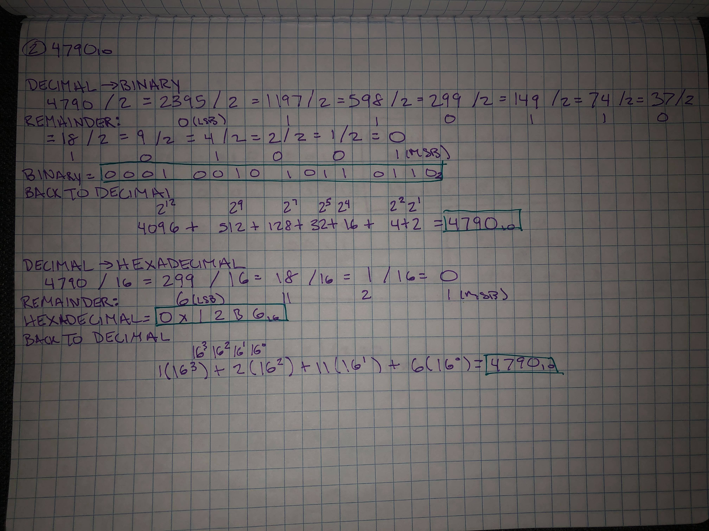
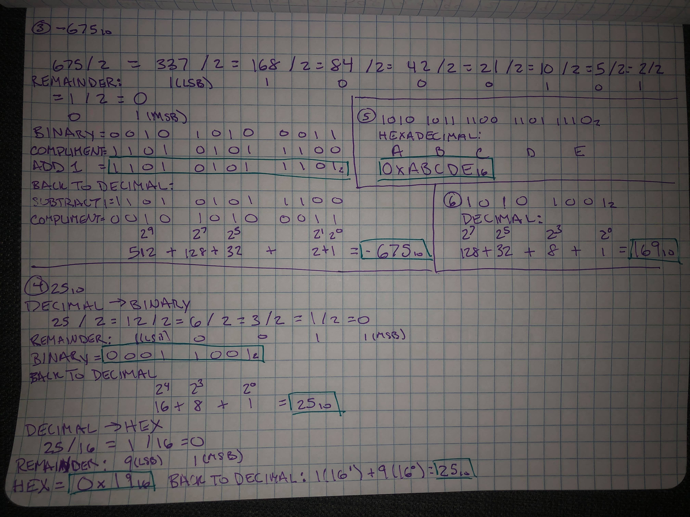

# Number Respresentation - Submission 1  
**DATE** SUN MAY 31ST 2020  
  
# Answers  
1. Convert -10567 to 16-bit two's complement. Double check the word by converting it back.  
  
  
2. Convert 479010 to binary and hexidecimal. Double check the word by converting it back.  
  
  
3. Write -67510 in 10-bit two's complement. Double check the word by converting it back.  
4. Convert the number 2510 to binary and hexidecimal. Double check the word by converting it back.  
5. Convert 101010111100110111102 to hexidecimal.  
6. Convert 101010012 to decimal.  
  

