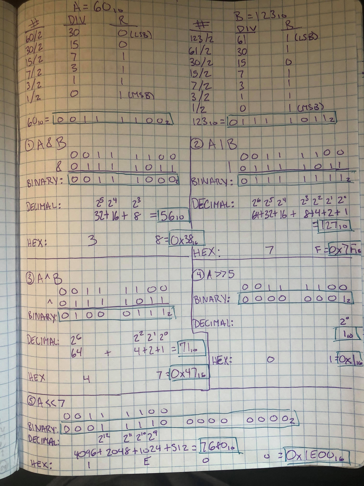
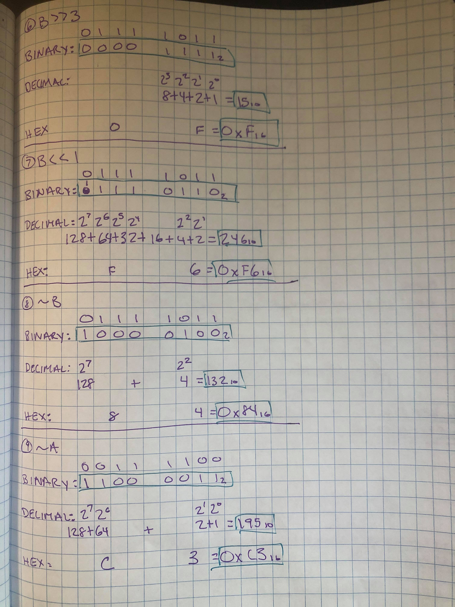
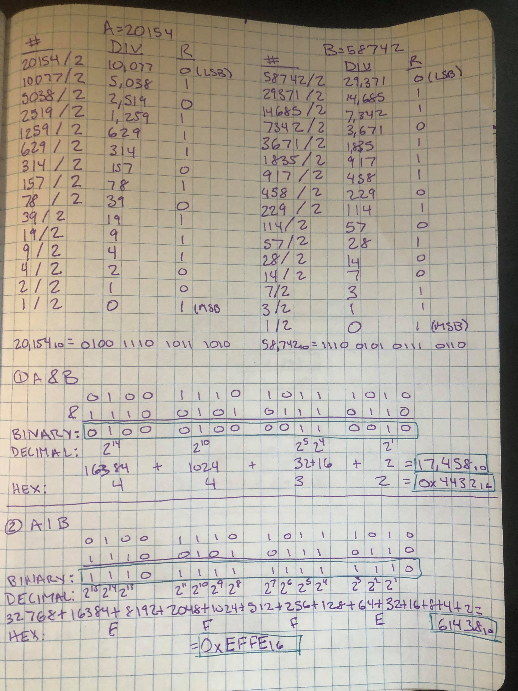
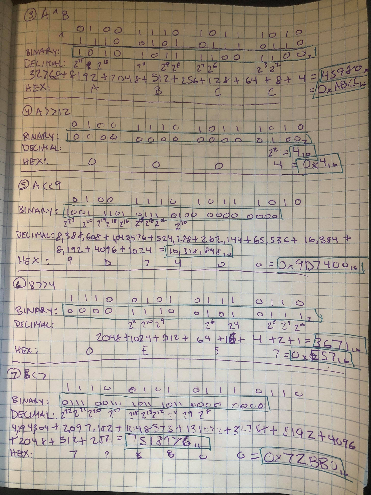
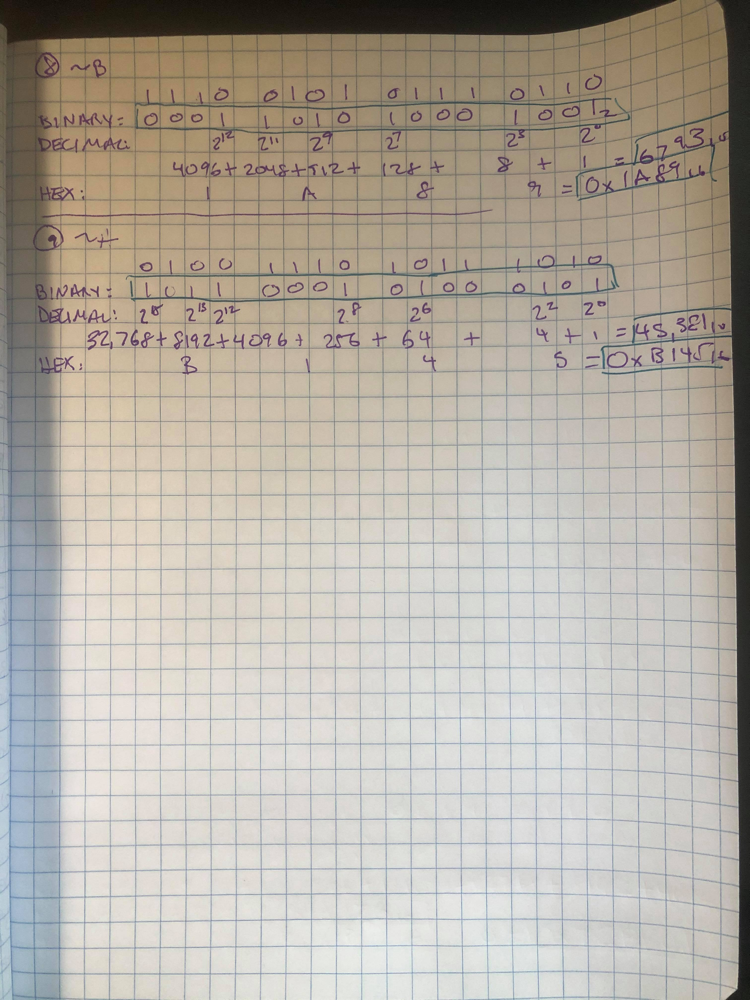

# BITWISE OPERATORS - Submission 1  
**DATE** WED JUNE 10TH 2020  
  
# Answers  
Round 1: Assume 8-bit unsigned numbers. Perform these operations with `A` being `60` and `B` being `123`. Give the result in binary, hex and decimal. **ALL BY HAND FOR PRACTICE**  
1.  `A & B`
2. `A | B`
3. `A ^ B`
3. `A >> 5`
4. `A << 7`
5. `B >> 3`
6. `B << 1`
7. `~B`
8. `~A`  
  
  

Round 2: Assume 16-bit unsigned numbers. Perform these operations with `A` being `20154` and `B` being `58742`.   Give the result in binary, hex and decimal. **ALL BY HAND FOR PRACTICE**    
1.  `A & B`
10. `A | B`
3. `A ^ B`
11. `A >> 12`
12. `A << 9`
13. `B >> 4`
14. `B << 7`
15. `~B`
16. `~A`  
  
  
  
  
Round 3:  Write C code to double check your answers. Post the C code with your submission  
Pending...  
